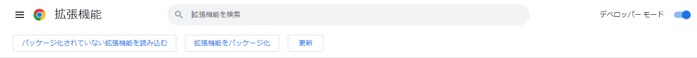
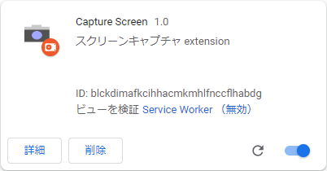

# Google Chrome Extension 置き場


<!-- @import "[TOC]" {cmd="toc" depthFrom=2 depthTo=6 orderedList=false} -->

<!-- code_chunk_output -->

- [Extensions](#extensions)
- [インストール手順(例)](#インストール手順例)
- [Chrome Extension 開発について](#chrome-extension-開発について)
  - [概要](#概要)
  - [manifest.json に構成定義](#manifestjson-に構成定義)
  - [extension の動作について](#extension-の動作について)
- [参考サイト](#参考サイト)

<!-- /code_chunk_output -->


Google Chrome 向けの Extension 置き場です。ご自由にお持ちになってください。

star を頂けますと大変励みになります。


## Extensions

- [Capture Screen](./capture-screen/)
試験エビデンス取得向け Extension。
表示しているページのスクリーンショットを取得します。


## インストール手順(例)
1. [Capture Screen](./capture-screen/) フォルダをダウンロード

2. [chrome://extensions](chrome://extensions) タブを開く

2-1. デベロッパーモードを on にする



2-2. [パッケージ化されていない拡張機能を読み込む] を押下

2-3. ダウンロードした `capture-screen/` フォルダを指定

3. Capture Screen が読み込まれていればインストール完了




## Chrome Extension 開発について

### 概要
Chrome Extension は、構成定義ファイルである `manifest.json` および、`html`, `css`, `js` を zip圧縮したアーカイブファイルです。Chrome に追加することで Chrome上部拡張機能バーのアイコンより利用することが可能となります。

以下に概要図を示します。


### manifest.json に構成定義
`manifest.json` に定義できる構成は以下になります。

- action

アイコンクリックで表示されるポップアップ。`html`, `css`, `js` で構成されます。

- background

ページ外で動作する Service Worker。データの永続化などに利用します。

- content-scripts

ページに埋め込むスクリプト。ページ内の dom 操作を行う場合は、content-script に記述となります。


(参考) capture-screen の manifest.json

``` manifest.json
{
  "name": "Capture Screen",
  "description": "スクリーンキャプチャ extension",
  "version": "1.0",
  "manifest_version": 3,
  "background": {
    "service_worker": "background.js"
  },
  "permissions": [
    "storage",
    "activeTab",
    "scripting"
  ],
  "action": {
    "default_popup": "popup.html",
    "default_icon": {
      "16": "/images/app_16.png",
      "32": "/images/app_32.png",
      "48": "/images/app_48.png",
      "128": "/images/app_128.png"      
    }
  },
  "content_scripts": [
    {
      "matches": [
        "*://*/*"
      ],
      "js": [
        "js/jquery-3.6.0.min.js",
        "js/html2canvas.min.js",
        "content-script.js"
      ]
    }
  ],
  "icons": {
    "16": "/images/app_16.png",
    "32": "/images/app_32.png",
    "48": "/images/app_48.png",
    "128": "/images/app_128.png"      
  }
}
```


### extension の動作について

`action`, `background`, `content-scripts` は概要図に示した通り相互に独立して動作しており、直接相互操作することはできません。

`content-scripts` の起動時に `message listener` を登録し、`action` から message を投げて任意の `content-script` を実行させることになります。

ここまでが Extension 固有の概念となります。
後は普通の web 開発です。公式の入門ページへ足を進めてみましょう！

[Chrome Developers Extensions > Getting Started](https://developer.chrome.com/docs/extensions/mv3/getstarted/)


## 参考サイト
[Chrome Developers Extensions](https://developer.chrome.com/docs/extensions/)
