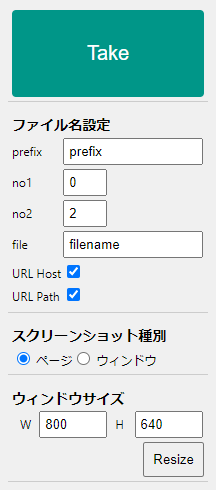

# Capture Screen
試験エビデンス取得向け Extension。

表示しているページ全体またはウィンドウ内のスクリーンショットを取得する。

## インストール方法

[Chrome Extension置き場 > インストール手順(例)](../ReadMe.md#インストール手順例)参照

## 操作

|機能   |説明   |
|---|---|
|[Take]ボタン   |スクリーンショットを取得し、ダウンロードフォルダに保存   |
|ファイル| 出力ファイル名設定 : `{prefix}_{no1}_{no2}_{file}.png` |
|prefix| ファイル名の prefix |
|no1| 連番1 |
|no2| 連番2 スクリーンショットを取得すると自動で 1 ずつ増加する。 |
|スクリーンショット種別||
|ページ| ページ全体のスクリーンショットを取得 |
|ウィンドウ| 表示中のウィンドウ内のスクリーンショットを取得 ※ヘッダやフッタを固定しているページでは正しく動作しないことがある模様 |
|リサイズ||
|W|ウィンドウ幅|
|H|ウィンドウ高さ
|[Resize]ボタン|ウィンドウリサイズを実行|

## 補足
[html2canvas](https://html2canvas.hertzen.com/) を利用してキャプチャ画像を生成。
